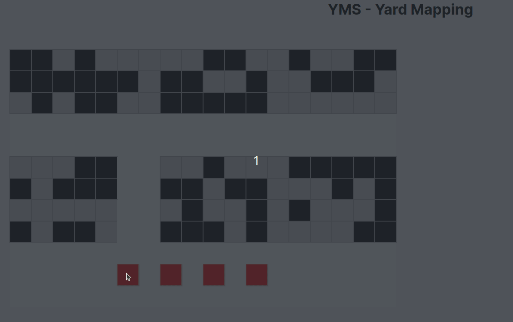

# Yard Mapping v.0.1.0



Este proyecto fue bootstrapped con [Create React App](https://github.com/facebook/create-react-app).

Para iniciar el proyecto, ejecuta `npm start` desde la terminal.

### Routes:

/ => La raíz muestra el prototipo de desarrollo de Maps.

/create => Form para creación de yards.

/list => TODO: Visualización de yards creadas.

---

### Peticiones

#### /architecture

La petición que se haría para visualizar la distribución devolverá un array de la siguiente forma para representar un yard:

```json
{
  "id": "{{$randomInt}}",
  "name": "{{$randomWord}}",
  "location": "{{$randomCity}}",
  "rows": 10,
  "cols": 6,
  "limit": 3,
  "dist": [
    [2, 2, 1, 2, 1, 1, 1, 1, 1, 2, 2, 1, 1, 2, 1, 1, 2, 2],
    [2, 2, 2, 2, 2, 2, 1, 2, 2, 1, 1, 2, 1, 1, 2, 2, 2, 1],
    [1, 2, 1, 2, 2, 1, 1, 2, 2, 2, 2, 2, 1, 1, 1, 1, 1, 1],
    [0, 0, 0, 0, 0, 0, 0, 0, 0, 0, 0, 0, 0, 0, 0, 0, 0, 0],
    [0, 0, 0, 0, 0, 0, 0, 0, 0, 0, 0, 0, 0, 0, 0, 0, 0, 0],
    [1, 1, 1, 2, 2, 0, 0, 1, 1, 2, 1, 1, 1, 2, 2, 2, 2, 2],
    [2, 1, 2, 2, 2, 0, 0, 2, 2, 1, 2, 2, 1, 1, 1, 2, 1, 2],
    [1, 1, 1, 1, 1, 0, 0, 1, 2, 1, 1, 2, 1, 2, 1, 1, 1, 2],
    [2, 1, 2, 2, 1, 0, 0, 2, 2, 2, 1, 2, 1, 1, 1, 1, 2, 2],
    [0, 0, 0, 0, 0, 0, 0, 0, 0, 0, 0, 0, 0, 0, 0, 0, 0, 0]
  ]
}
```

Al tener la representación de la distribución espacial de los yards en un array bidimensional se hace más fácil controlar cada celda de forma individual sin afectar el performance de la herramienta. Cabe aclarar que cada número **representará un estado específico de la celda**.

Ese estado puede ser:

> 0: deshabilitado (bg-white). Sirve para representar pasillos. TODO: implementar no-snap en esta zona.

> 1: disponible (bg-gray). Se debe poder hacerle snap.

> 2: ocupado. (bg-black).

Esta lista incluirá todos los posibles escenarios que pueda tener una celda, representados en un número.

---

### Funcionamiento

La representación de un yard utiliza canva, pensado para hacer sistemas interactivos eficientes. Se encuentra implementado un grid que simboliza la distribución de los yards en dos dimensiones. La celda de color rojo (que representa un object) podrá funcionar como un drag-and-drop a lo largo del grid, respetando las reglas del negocio.

Aprovechando algunos eventos que se disparan con las interacciones (al dar clic para arrastrar un container, al tenerlo arrastrado y al soltarlo), usamos código JS para representar dichos comportamientos.

En la consola del navegador se está imprimiendo la posición del container una vez se suelta, junto con su posición anterior, en un par [X, Y]. Esta lógica permitirá comparar contra el array de **/architecture** y decir si una celda es válida para ubicar allí ese container/object.

### Al guardar

El estado de la edición puede guardarse en memoria durante la ejecución (una variable) y hacer el update (opción con botón Save).

Por otro lado también se puede guardar por cada edición (implementación de WebSockets o guardado automático por HTTP en el dragEnd). Tener en cuenta costes de memoria, número de peticiones a servidores y latencia y performance.
